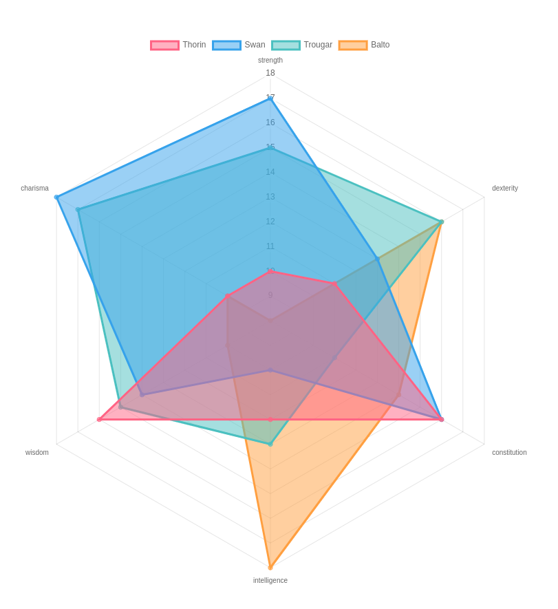

# RPG Party Stats

Visualization for my role playing party composition.
Built with [ChartJS](http://chartjs.org).

## Build and Run App
1. `npm install`
2. `npm run build`
3. `npm start`
4. Open browser and navigate to [http://localhost:3333]
